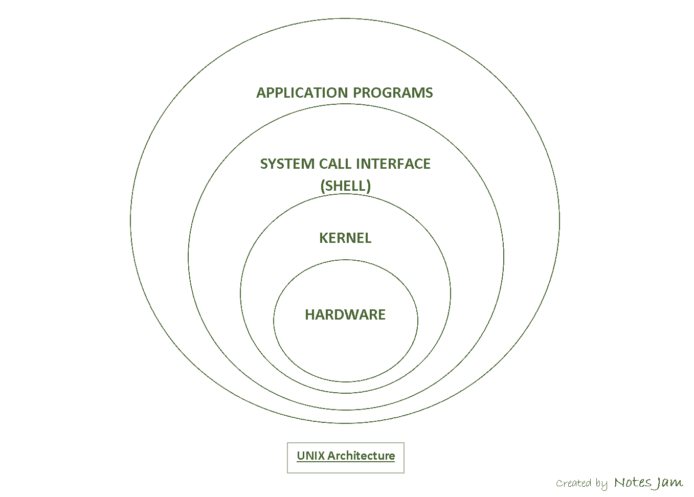

**Weiß was ein Betriebsystem ist**

Ein Betriebssystem ist eine Zusammenstellung von Computerprogrammen, die die Systemressourcen eines Computers, wie Arbeitsspeicher, Festplatten, Ein- und Ausgabegeräte verwaltet und diese Anwendungsprogrammen zur Verfügung stellt. Das Betriebssystem bildet dadurch die Schnittstelle zwischen den Hardware-Komponenten und der Anwendungssoftware des Benutzers.

**Weiß, welche grundlegenden Aufgaben ein Betriebssystem erledigt**

- Verbergen der Komplexität der realen Maschine (HW) vor dem Anwender
- Bereitstellen einer Benutzerschnittstelle (Kommandointerpreter - Shell u./o. Graphische Oberfläche - GUI)
- Bereitstellen einer normierten Programmierschnittstelle (API)
- Verwalten der Resourcen der realen Maschine
  - Prozessor(en)
  - Hauptspeicher
  - Hintergrundspeicher ( Festplatten SSDs, ...)
  - Geräte (Bildschirm, Tastatur, Netzwerkkarte, ...)
  - Rechenzeit

- Verfolgung von Schutzstrategien bei dieser Resourcenbereitstellung (Zugriffsrecht auf Daten und Prozesse)
  Koordination von Prozessen (Interprozesskommunikation, ...)

**Weiß, was das Schichtenmodell von UNIX bedeutet**

**Weiß, was CLI und GUI bedeuten**

CLI = Command-line interface
GUI = Graphical User Interface

**Weiß, was ein CLI auszeichnet und wozu es dient**

**Weiß, was "offen/geschlossen " für ein Betriebssystem bedeutet**

Closed-source = Windows, OS X
Open-source (öffentlicher Code, der für jeden einsehbar ist) = Linux

**Weiß, was "portabel " für ein Betriebssystem bedeutet**

Nutzung von Software auf vielen verschiedenen Plattformen anstatt einer einzigen Plattform.

**Weiß, was "skalierbar " für ein Betriebssystem bedeutet**

**Weiß, warum UNIX als "stabiles, sicheres" Betriebssystem angesehen wird**

**Weiß, warum UNIX als "modernes " Betriebssystem angesehen wird**

**Weiß, was "multi user " für ein Betriebssystem bedeutet**

Mehrere Nutzer können das System gleichzeitig nutzen, ohne dabei andere Nutzer zu stören (Dateien, Einstellungen, etc).

**Weiß, was "multi tasking " für ein Betriebssystem bedeutet**

Erlaubt das gleichzeitige ausführen von mehreren Programmen.

**Weiß, warum UNIX auch ein Netzwerk-Betriebssystem ist**

**Weiß, was das "X-Window System " ist**

Das X Window System (auch X Version 11, X11, X) ist ein Netzwerkprotokoll und eine Software, die Fenster auf Bitmap-Displays auf den meisten unixoiden Betriebssystemen und OpenVMS ermöglicht. X11 wurde auf allen gebräuchlichen Betriebssystemen implementiert.

[Wikipedia](https://de.wikipedia.org/wiki/X_Window_System)

**Weiß, warum X-Window auch ein "Netzwerk-GUI " ist**

Netzwerkprotokoll

Lässt sich über SSH von einem Server an einen privaten Rechner weiterleiten

**Weiß, was man unter der "UNIX-Philosophie " versteht**

Die Unix-Philosophie ist eine Menge von Regeln und Herangehensweisen bei der Software, die auf den Erfahrungen der führenden Unix-Programmierer basieren.

**Weiß, was mit "keep it small and simple " gemeint ist**

Eine Aufgabe wir in kleine Teile zerlegt werden für deren Bearbeitung einzelne Programme verantwortlich sind. Das einzelne Programm erledigt dabei möglicherweise nur eine triviale Arbeit, diese aber so gut wie möglich.

**Weiß, was mit "build your work on top of others " gemeint ist**

Das Rad muss nicht immer wieder erneut erfunden werden. Es gibt bei UNIX Hunderte Programme, die - wenn sie meinteinander kombiniert werden - Aufgaben erledigen, für die bei anderen Systemen erst ein spezielles Programm geschrieben werden muss.

**Weiß, was mit "don't hardwire anything " gemeint ist**

Bei Unix ist nur wenig "fest verdrahtet". Der Benutzer kann das Systemverhalten gemäß seiner Präferenzen einstellen und sich eine ganz individuelle Umgebung schaffen. Diese Tatsache wird von Einsteigern oft kritisiert, da sich die Oberfläche auf anderen UNIX-System von dem, was sie gewohnt sind, unterscheiden kann.
